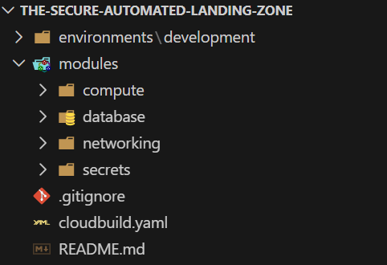
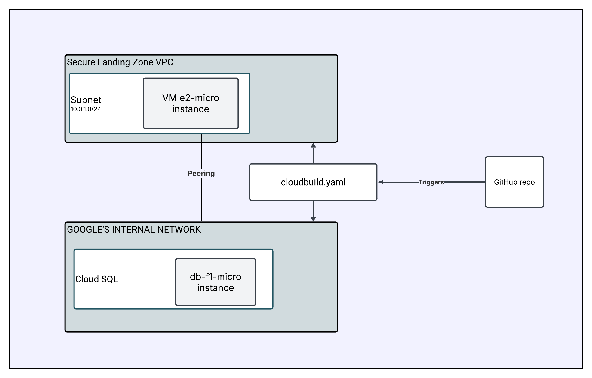

# The Secure Automated Landing Zone

## Project Overview
This project was created as a requirement for the **Google Cloud Platform Bootcamp hosted by Globant**.

## Repository Architecture

Below is the visual layout of the project codebase:

### What is Modular Infrastructure?
Instead of writing hundreds of lines of code into a single, unorganized file, this project uses a **modular design**. By splitting the components into dedicated folders under `modules/`, the infrastructure becomes completely reusable, highly readable, and isolated. This allow to scale the infrastructure cleanly—meaning we could spin up an identical testing or production environment later without changing our core code logic.

### Folder Breakdown & Contents:

* **`environments/development/`**: This is the core environment tracking folder. It functions as the infrastructure's orchestrator, housing your environment-specific files (`variables.tf`, `providers.tf`). This directory is what **calls all of our modules** and passes parameters between them to initiate the build.
* **`modules/networking/`**: Builds the foundation. It provisions a custom VPC, isolated private-only subnets (with private Google API access enabled), and maps out the crucial Private Network Peering Connection.
* **`modules/secrets/`**: Handles security. It provisions GCP Secret Manager to securely store and reference the database password version, keeping raw sensitive strings completely out of source control.
* **`modules/compute/`**: Deploys the application tier. It handles the deployment of an internal `e2-micro` Virtual Machine instance nested inside the private subnet.
* **`modules/database/`**: Deploys the data tier. It creates a private `db-f1-micro` Cloud SQL instance that communicates completely hidden from the open internet.
* **`cloudbuild.yaml`**: This configuration file lives in the root directory and defines the exact automated steps Google Cloud Build must take to execute the code.

---

## Technical Architecture & Connections

The modules work together by passing outputs and variables between each other to build the full infrastructure. Refer to the structural diagram below to see how these resource relationships connect:

### How the Pieces Link Together:

1. **Networking to Database:** The `networking` module creates the custom VPC and routes a private service connection. The orchestration layer (`environments/development/main.tf`) catches this network mapping and passes it straight to the `database` module so Cloud SQL can register itself purely on an internal IP address.
2. **Secrets to Database:** The `secrets` module securely hosts the credential version inside Secret Manager. The entry point references this container and feeds the database password directly into the `database` module to instantiate the root user password safely during creation.
3. **Networking to Compute:** The `networking` module provisions the private subnet layout. The `compute` module consumes that subnet link output to deploy the `e2-micro` application server into an isolated, secure network space.

---

## The Automation Pipeline (CI/CD)

The entire landing zone utilizes a complete workflow managed by Google Cloud Build:

* **The Trigger:** Any code change or infrastructure adjustment pushed to the `main` branch on GitHub automatically signals a webhook that starts a Cloud Build execution.
* **The Identity:** The pipeline runs under the project's **Compute Engine default service account**, which has been granted explicit IAM permissions (`Compute Admin`, `Cloud SQL Admin`, `Secret Manager Secret Accessor`, and `Service Networking Admin`) to execute code on behalf of the project safely.
* **The State Storage:** The initialization step automatically checks for and manages an isolated GCS backend bucket (`$PROJECT_ID-terraform-state-lz`) to securely store and maintain the global Terraform state file locks.
